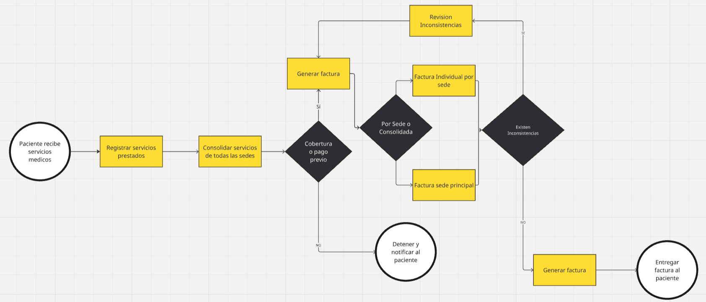

# 🗒️ Registro de Trabajo en Clase - Taller Taller 1- BPMN

## 📆 Fecha de la sesión
9 de agosto de 2025

## 👥 Integrantes presentes
- Sergio Socha
- Nicolas Rodriguez
- Julián Pinilla
- Cristian Soto

## 🧠 Actividades realizadas en clase
- ¿Qué discutimos?
Acordamos el alcance: facturar servicios multi-sede desde que termina la atención del paciente. Identificamos tres “dolores”: falta de cobertura/pago, factura por sede vs. consolidada e inconsistencias de datos.

- Decisiones de modelado
	•	XOR 1: Cobertura o pago previo (Sí → sigue; No → Detener y notificar).
	•	XOR 2: Modalidad de factura (Por sede o Consolidada).
	•	XOR 3: Existen inconsistencias (Sí → Revisión y reintento; No → Generar factura).
	•	Tareas claras: Registrar → Consolidar → Generar → Revisar.

- Herramientas
Boceto rápido en pizarra y modelado preliminar en draw.io (captura adjunta).

- Avance
Quedó el flujo completo con inicio/fin, tareas y gateways; pendiente pulir swimlanes y rotular mejor los caminos Sí/No para la versión final.

## 🧩 Boceto inicial del modelo

## 🔁 Tareas definidas para complementar el taller

Anote las responsabilidades acordadas entre los miembros del equipo para completar la entrega final:

| Tarea asignada                                              | Responsable       | Fecha estimada |
|-------------------------------------------------------------|-------------------|----------------|
| Modelado final en draw.io con swimlanes y notación BPMN     | Sergio Socha      | 17/08/2025     |
| Modelado final en draw.io con swimlanes y notación BPMN     | Nicolas Rodriguez | 18/08/2025     |
| Redacción del informe técnico (versión final)               | Julián Pinilla    | 18/08/2025     |
| Validación contra requisitos del caso (cobertura, consolidación, inconsistencias) | Cristian Soto | 19/08/2025     |
---

_Este documento resume el trabajo colaborativo realizado durante la sesión del taller X en el curso AREM - Universidad de La Sabana._
