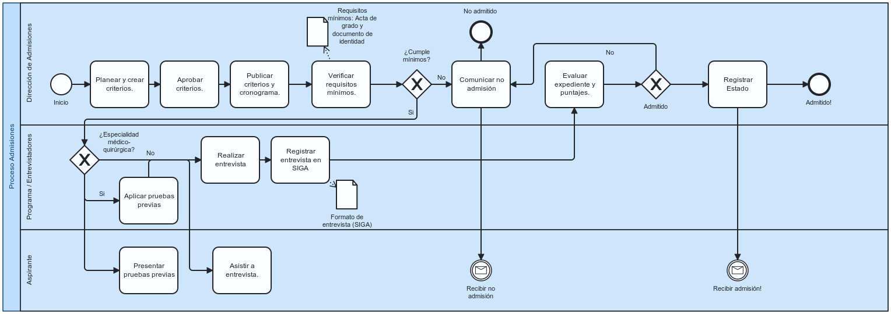

# 📄 Informe Técnico del Taller

## 🔖 Nombre del Taller
_Taller 5 – Modelado AS‑IS (BPMN) del Proceso de Admisión de Posgrados (PIAMI)_

## 👥 Integrantes del equipo
- Nicolas Rodriguez (nicorodri18)
- Sergio Socha (sergiosocha)
- Julián Pinilla (julianpiav)

## 🧠 Descripción general del trabajo
Se modela el BPMN el AS‑IS del proceso de Admisión de Posgrados (PIAMI) con tres lanes (Dirección de Admisiones, Programa/Entrevistadores y Aspirante), aplicando la notación BPMN 2.0 y buenas prácticas de modelado. 
## 🔧 Proceso de desarrollo
1. **Levantamiento**: Se hablo con la dueña del Macro proceso PIAMI Lina Paola Gómez Fajardo. También se consultaron las fuentes formales de **BPMN** y **TOGAF** para el marco metodológico.  
2. **Modelado**: Se modelo en  **bpmn.io**  
3. **Validación**: revisión cruzada del equipo para asegurar c

## 🧩 Análisis del modelo propuesto
- **Estructura**: 1 pool con 3 lanes. Dos **gateways exclusivos** claves: `¿Cumple mínimos?` (verificación de requisitos) y `¿Especialidad médico‑quirúrgica?` (rama con **pruebas previas** antes de entrevista). Gateway final `¿Admitido?` con finales **Admitido** / **No admitido**.  
- **Representación de necesidades**: el modelo hace visible la experiencia del **aspirante** (presentar pruebas, asistir a entrevista y **recibir** el resultado), el trabajo del **Programa** (entrevista y registro en **SIGA**) y la decisión formal de **Admisiones**.  
- **Supuestos**: (1) Los requisitos **mínimos** para entrevista incluyen documento y **acta/diploma de grado**; (2) En especialidades médico‑quirúrgicas existen **pruebas previas**; (3) El registro institucional de entrevistas se realiza en **SIGA**; (4) La comunicación del resultado al aspirante ocurre tras la evaluación integral.  

## 📈 Diagrama final entregado

## 📋 Tabla de actores, entidades o componentes (si aplica)
| Nombre del elemento              | Tipo    | Descripción                                                       | Responsable                    |
|----------------------------------|---------|-------------------------------------------------------------------|--------------------------------|
| Dirección de Admisiones          | Rol     | Define criterios, verifica mínimos y decide la admisión           | Universidad – Admisiones       |
| Programa / Entrevistadores       | Rol     | Realiza entrevistas y diligencia formatos institucionales         | Programa académico              |
| Aspirante                        | Actor   | Presenta pruebas (si aplica), asiste a entrevista y recibe decisión | Candidato                      |
| SIGA                             | Sistema | Sistema académico donde se registra la entrevista y seguimiento| Universidad (plataforma SIGA)  |

## 🔍 Investigación complementaria
### Tema investigado:
(Ej: Buenas prácticas BPMN, comparación TOGAF vs C4, principios de seguridad STRIDE, etc.)

### Resumen:
La especificación BPMN 2.0.2 del OMG es el estándar para modelar procesos, con elementos para eventos, actividades, gateways y flujos. Usamos sequence flows dentro del mismo participante y message flows entre participantes (Admisiones ↔ Programa ↔ Aspirante) para representar comunicación y responsabilidades, lo cual mejora la legibilidad y evita ambigüedades. Las guías de Camunda recomiendan modelar explícitamente (gateways con preguntas claras y etiquetas “Sí/No”, evitar construcciones implícitas) y mantener el diagrama simple, consistente y orientado a lectura L→R. En el marco de arquitectura, TOGAF proporciona el método ADM para enmarcar el AS‑IS como insumo de la Arquitectura de Negocio y la visión de transformación.

## 📚 Referencias
- OMG. *Business Process Model and Notation (BPMN) 2.0.2 Specification*. https://www.omg.org/spec/BPMN/2.0.2/  
- bpmn.io. *bpmn‑js: BPMN 2.0 rendering toolkit and web modeler*. https://bpmn.io/toolkit/bpmn-js/  
- Camunda Docs. *Creating readable process models (Best Practices)*. https://docs.camunda.io/docs/components/best-practices/modeling/creating-readable-process-models/  
- The Open Group. *The TOGAF® Standard*. https://www.opengroup.org/togaf  
- Universidad de La Sabana. *Admisiones y financiación – Posgrado (Documentos para la entrevista)*. https://www.unisabana.edu.co/admisiones-y-financiacion/posgrado  
- Universidad de La Sabana. *Estudiantes (SIGA / APP UniSabana)*. https://www.unisabana.edu.co/estudiantes
---

_Este documento hace parte de la entrega del taller X del curso AREM (Arquitectura Empresarial) - Universidad de La Sabana._